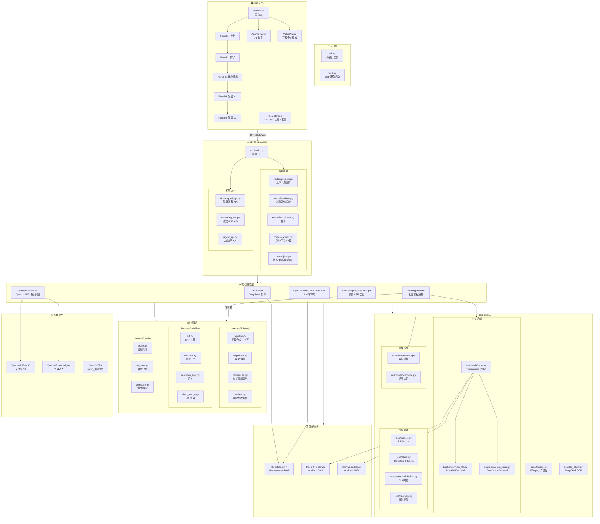
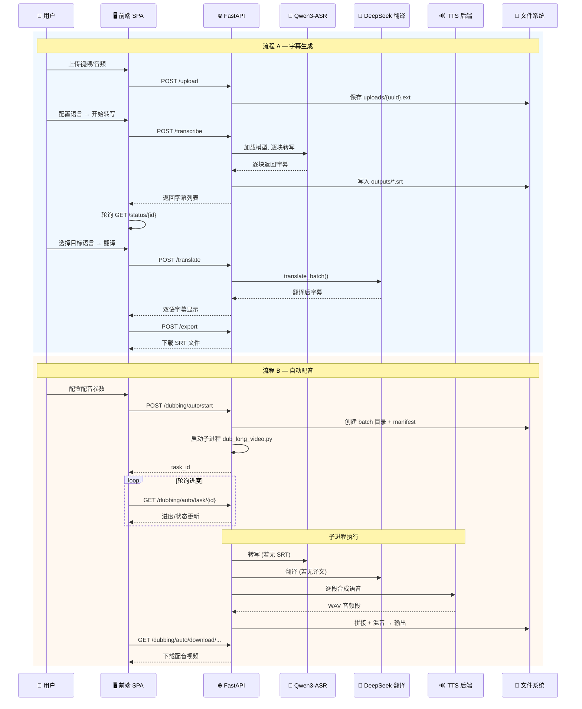
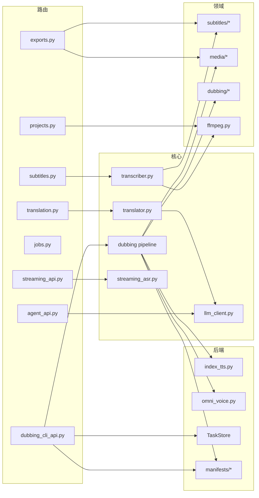

# Subtitle Maker — 项目架构图

## 整体分层架构



## 数据流



## 模块依赖关系



## 关键设计模式

| 模式 | 位置 | 说明 |
|---|---|---|
| **全局单例** | `legacy_runtime.py`, `streaming_asr.py` | ASR 模型懒加载,加锁保证线程安全 |
| **后台任务** | `web.py`, `dubbing_cli_api.py` | CPU 密集操作通过 `asyncio.to_thread()` 异步化 |
| **子进程编排** | `dubbing_cli_api.py` → `tools/dub_long_video.py` | 配音流程以独立子进程运行,通过 manifest JSON 通信 |
| **轮询模式** | 前端 JS → `GET /status/`, `GET /dubbing/auto/task/` | 前端定时轮询后端任务状态 |
| **策略模式** | `backends/base.py` → `index_tts.py`, `omni_voice.py` | TTS 后端抽象基类,可插拔切换 |
| **清单持久化** | `manifests/` | 配音任务状态以 JSON 文件持久化,支持恢复/重配 |
| **线程安全存储** | `jobs/store.py` → `TaskStore(RLock)` | 配音任务使用 RLock 保护的字典存储 |
| **localStorage** | 前端 | API Key、主题、TTS 后端选择等用户配置持久化在浏览器 |

## 目录职责速览

```
src/subtitle_maker/
├── app/             FastAPI 应用 + 路由 (HTTP 层)
├── backends/        TTS 后端抽象 + 实现 (Index-TTS, OmniVoice)
├── core/            FFmpeg 封装 + LLM SDK 客户端
├── domains/         纯领域逻辑 (字幕/媒体/配音)
├── jobs/            任务记录 + 线程安全存储 + CLI 构建
├── manifests/       配音批次的 JSON 清单读写
├── qwen_tts/        内嵌 Qwen3-TTS 推理代码
├── static/          前端 CSS/JS
├── templates/       Jinja2 HTML 模板
├── cli.py           命令行入口
├── web.py           Web 服务入口
├── transcriber.py   Qwen3-ASR 封装
├── translator.py    DeepSeek 翻译客户端
├── dubbing_cli_api.py  配音 REST API (~1500 行)
├── streaming_asr.py     流式 ASR 会话管理
├── streaming_api.py     流式 ASR HTTP 路由
└── agent_api.py         产品内 AI 助手
```
