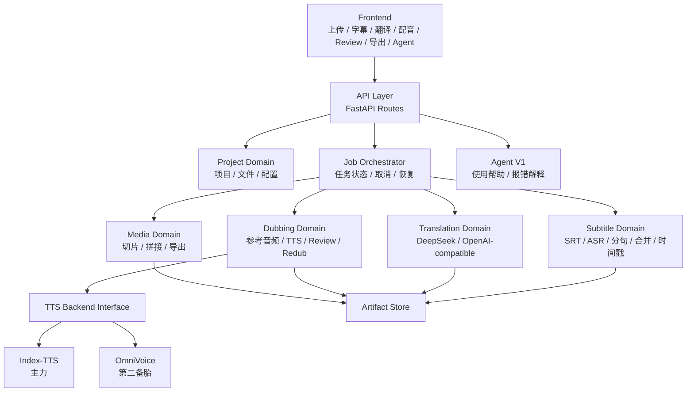

# 目标架构

日期：2026-04-24

## 架构目标

- 主业务代码从脚本式增长转为领域分层。
- 旧 API、旧 CLI、旧 batch 在迁移期保持兼容。
- 模型服务和 Web 进程解耦，避免依赖冲突。
- Agent V1 作为使用帮助入口，不进入任务执行链路。

## 目标架构图



## 目标目录

```text
src/subtitle_maker/
  app/
    main.py
    routes/
      projects.py
      subtitles.py
      translation.py
      dubbing.py
      exports.py
      jobs.py
      agent.py

  core/
    config.py
    paths.py
    errors.py
    logging.py
    ffmpeg.py
    llm_client.py

  domains/
    subtitles/
      srt.py
      asr.py
      sentence_split.py
      short_merge.py
      timeline.py

    translation/
      service.py
      prompts.py

    dubbing/
      pipeline.py
      references.py
      alignment.py
      review.py
      backends/
        base.py
        index_tts.py
        omni_voice.py

    media/
      probe.py
      segment.py
      compose.py
      export.py

  jobs/
    models.py
    store.py
    runner.py
    command_builder.py

  manifests/
    schema.py
    readwrite.py
```

## 模块职责

| 模块 | 职责 | 不负责 |
|---|---|---|
| `app/routes/*` | HTTP request/response、参数校验、调用 service。 | 业务算法、文件格式细节、模型调用细节。 |
| `jobs/*` | 任务创建、状态、取消、恢复、命令构造。 | 字幕/音频/TTS 算法。 |
| `manifests/*` | batch/segment/review manifest schema 和读写兼容。 | 任务执行。 |
| `domains/subtitles/*` | SRT、ASR 输出规范化、分句、合并、时间戳。 | 翻译和配音。 |
| `domains/translation/*` | 翻译 prompt、provider 调用、输出校验。 | 字幕时间轴和 TTS。 |
| `domains/dubbing/*` | 参考音频、逐句合成、对齐、review/redub。 | Web API 和长视频切片。 |
| `domains/media/*` | ffmpeg/ffprobe、切片、拼接、导出。 | 语言模型调用。 |
| `core/*` | 通用配置、路径、错误、日志、LLM client、ffmpeg wrapper。 | 产品域决策。 |

## 数据流和所有权

目标架构必须避免“同一个字段到处写”的问题。字段所有权固定如下：

| 数据 | 唯一写入方 | 读取方 | 规则 |
|---|---|---|---|
| `Project` | `jobs/store.py` 或 `app/routes/projects.py` | API、Job runner、前端状态恢复 | 不由 pipeline 脚本直接写。 |
| `Job` | `jobs/store.py` / `jobs/runner.py` | API status、Agent 后续扩展、UI polling | 任务状态不再散落在多个全局 dict。 |
| `PipelineOptions` | `jobs/command_builder.py` | CLI wrapper、manifest、review redub | 创建任务时冻结，重跑时从 manifest 恢复。 |
| `BatchManifest` | long-video orchestrator | API load-batch、review、artifact 列表 | 只描述 batch 级产物和 segment 索引。 |
| `SegmentManifest` | single-segment pipeline | batch merge、review/redub、debug | 只描述单段输入、字幕、合成记录和错误。 |
| `Artifact` | 产生产物的 domain | API、UI、Agent 后续扩展 | 路径必须可从 project/batch/segment root 解析。 |

## 编排边界

`jobs/runner.py` 是唯一允许串联多个 domain 的层。

```text
API route
  -> validate request
  -> create Project / Job / PipelineOptions
  -> runner executes domains
  -> manifests + artifacts are written
  -> API status reads Job + Manifest
```

禁止事项：

- `app/routes/*` 不直接拼 `dub_pipeline.py` 参数。
- `domains/*` 不直接读取 FastAPI form 字段。
- `review/redub` 不重新猜测 target language、pipeline version、grouped synthesis、timing mode。
- `load-batch` 不把缺失字段静默改成当前默认值；必须标记为 legacy inferred。

## 旧入口兼容

| 旧入口 | 兼容策略 |
|---|---|
| `subtitle-maker-web` | 保持可启动，内部逐步迁到 `app/main.py`。 |
| `src/subtitle_maker/web.py` | 迁移期保留，逐步变成 app 初始化 wrapper。 |
| `tools/dub_pipeline.py` | 迁移期保留 CLI，核心逻辑逐步调用 `domains/*`。 |
| `tools/dub_long_video.py` | 迁移期保留 CLI，编排逻辑逐步调用 `jobs/*` 和 `domains/media/*`。 |
| `src/subtitle_maker/static/app.js` | 迁移期保留入口，后续拆模块。 |

## 兼容层策略

迁移期保留 CLI wrapper，但 wrapper 只能做三件事：

1. 解析旧命令行参数。
2. 转成 typed options。
3. 调用新 domain / runner。

不允许在 wrapper 中继续新增业务分支。新功能只能进入 domain、jobs 或 manifests 层。

## 模型服务边界

| 服务 | 边界 |
|---|---|
| ASR | 可以保留当前本地调用，后续服务化。 |
| Translation | 统一 OpenAI-compatible LLM client。 |
| Index-TTS | 继续作为独立 HTTP 服务。 |
| OmniVoice | 作为独立 adapter/进程，不污染主 Web 环境。 |
| Demucs | 作为可选媒体处理依赖，后续可独立 worker。 |

## 前端目标结构

```text
src/subtitle_maker/static/js/
  app.js
  apiClient.js
  player.js
  uploadPanel.js
  subtitlePanel.js
  translationPanel.js
  dubbingPanel.js
  reviewPanel.js
  agentDrawer.js
```

第一阶段不强制迁移到该结构。Agent V1 可以先小范围接入现有 `app.js`，但新增代码要保持可迁移。

## Review 2 结论

目标架构确认以“协议优先”为中心：先统一 `PipelineOptions`、manifest、job/artifact 所有权，再拆领域模块。否则直接拆文件会把现有字段漂移问题复制到新目录里。
