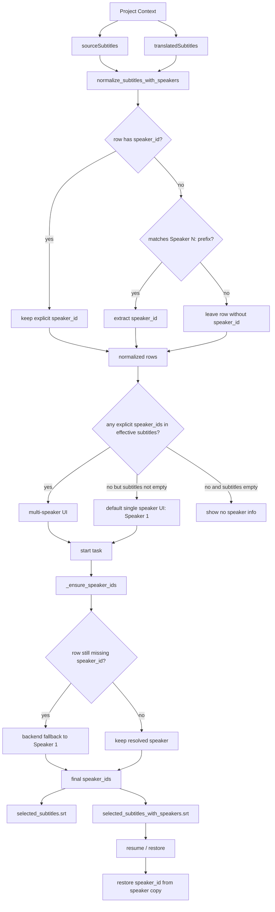

# Speaker ID 识别逻辑

## 目的

这份文档只做一件事：把项目里和 `speaker_id` 相关的“当前实现”与“应固定合同”梳理清楚，避免后续在 5 号面板、6 号面板、字幕导入、恢复链路里各自按感觉改，最终把 speaker 逻辑改成屎山。

本文所有结论都必须能在代码里找到出处。

## 1. 数据真值来源

### 1.1 当前项目上下文

当前前端所有配音面板读取的项目字幕真值都来自：

- 文件：[src/subtitle_maker/static/app.js](/Users/tim/Documents/vibe-coding/MVP/subtitle-maker/src/subtitle_maker/static/app.js)
- 函数：`getProjectDubbingContext()`

返回结构里有两份字幕：

- `sourceSubtitles`
- `translatedSubtitles`

它们分别对应：

- `sourceSubtitles = originalSubtitlesData`
- `translatedSubtitles = translatedSubtitlesData`

也就是说，5 号面板和 6 号面板不是自己维护字幕真值，而是直接消费当前项目上下文里的这两份数组。

## 2. 底层 speaker 识别规则

### 2.1 识别入口

底层统一入口在：

- 文件：[src/subtitle_maker/domains/subtitles/speakers.py](/Users/tim/Documents/vibe-coding/MVP/subtitle-maker/src/subtitle_maker/domains/subtitles/speakers.py)
- 函数：`strip_speaker_prefix()`
- 函数：`normalize_subtitles_with_speakers()`

### 2.2 当前规则

`strip_speaker_prefix()` 当前只识别明确的：

- `Speaker 1: ...`
- `Speaker A: ...`
- `speaker x: ...`

对应正则：

- `SPEAKER_PREFIX_RE = ^\\s*(?P<speaker>Speaker\\s+\\S+)\\s*[:：]...`

这意味着：

- 普通英文正文里的冒号，不应该再被当作 speaker
- 类似 `Ideas are everywhere: ...` 不应再产出 `speaker_id`

### 2.3 sidecar 优先级

`normalize_subtitles_with_speakers()` 的当前合同是：

1. 如果字幕行已经显式带了 `speaker_id`
2. 则直接保留这个 `speaker_id`
3. 并且正文里的普通冒号不再参与 speaker 识别
4. 只有在 `speaker_id` 为空时，才尝试从正文里的 `Speaker N:` 前缀识别

代码出处：

- 文件：[src/subtitle_maker/domains/subtitles/speakers.py](/Users/tim/Documents/vibe-coding/MVP/subtitle-maker/src/subtitle_maker/domains/subtitles/speakers.py)
- 函数：`normalize_subtitles_with_speakers()`

这是整个系统最重要的一条合同：

- `speaker_id sidecar` 的可信度高于正文前缀推断

## 3. 5 号面板当前实现

### 3.1 5 号面板前端读哪份字幕

5 号面板前端在：

- 文件：[src/subtitle_maker/static/js/omnivoiceDubbingPanel.js](/Users/tim/Documents/vibe-coding/MVP/subtitle-maker/src/subtitle_maker/static/js/omnivoiceDubbingPanel.js)
- 函数：`getEffectiveSubtitleRows(projectContext)`

逻辑是：

1. 如果当前 `subtitle_mode === translated` 且 `translatedSubtitles` 非空，就用 `translatedSubtitles`
2. 如果当前 `subtitle_mode === source` 且 `sourceSubtitles` 非空，就用 `sourceSubtitles`
3. 否则优先 `translatedSubtitles`，再退回 `sourceSubtitles`

### 3.2 5 号面板前端如何提取 speaker 列表

当前实现位置：

- 文件：[src/subtitle_maker/static/js/omnivoiceDubbingPanel.js](/Users/tim/Documents/vibe-coding/MVP/subtitle-maker/src/subtitle_maker/static/js/omnivoiceDubbingPanel.js)
- 函数：`getDetectedSpeakerIds(projectContext)`

当前逻辑：

1. 先拿 `getEffectiveSubtitleRows(projectContext)` 的结果
2. 只读取每一行里已经显式存在的 `speaker_id`
3. 去重后返回 speaker 列表
4. 当前版本不会再从前端正文文本里猜 speaker
5. 当前版本也不会在前端按 source 时间轴补 speaker

这条收紧是为了避免把脏文本误识别结果直接放大到 UI。

### 3.3 5 号面板后端如何补 speaker

5 号面板后端位置：

- 文件：[src/subtitle_maker/omnivoice_dub_api.py](/Users/tim/Documents/vibe-coding/MVP/subtitle-maker/src/subtitle_maker/omnivoice_dub_api.py)
- 函数：`_ensure_speaker_ids()`

当前逻辑：

1. 如果当前行已有 `speaker_id`，直接保留
2. 否则优先按 `fallback_rows` 的时间重叠匹配 speaker
3. 若无重叠，按最近时间窗匹配
4. 再不行，按同索引 `fallback_rows[index]`
5. 还不行，回退上一行 speaker
6. 最后兜底为 `Speaker 1`

这是 5 号面板后端真正的“补 speaker 真值”逻辑。

### 3.4 5 号面板启动任务时如何决定 speaker 映射

位置：

- 文件：[src/subtitle_maker/omnivoice_dub_api.py](/Users/tim/Documents/vibe-coding/MVP/subtitle-maker/src/subtitle_maker/omnivoice_dub_api.py)
- 接口：`start_omnivoice_from_project()`

关键点：

1. 前端会提交：
   - `source_subtitles_json`
   - `translated_subtitles_json`
   - `speaker_ref_speaker_ids_json`
   - `speaker_ref_files`
2. 后端先对用于本轮预览的字幕执行：
   - `_ensure_speaker_ids(..., fallback_rows=source_rows, force_align_by_time=True)`
3. 然后从这份对齐后的 rows 中提取 `speaker_ids`
4. 再校验前端传来的 `speaker_ref_speaker_ids_json` 是否都包含在后端这份 `speaker_ids` 里

这就是之前出现：

- `unknown speaker_id in uploaded OmniVoice references`

的直接原因所在。

### 3.5 5 号面板 prepared / resume 链路和 speaker

位置：

- 文件：[src/subtitle_maker/omnivoice_dub_api.py](/Users/tim/Documents/vibe-coding/MVP/subtitle-maker/src/subtitle_maker/omnivoice_dub_api.py)
- 函数：`_build_selected_subtitles_with_speaker_rows()`
- 函数：`_parse_selected_subtitles_with_speaker()`
- 函数：`_load_selected_subtitles_from_manifest()`

当前合同：

1. 5 号面板在生成 `selected_subtitles.srt` 的同时
2. 还会额外落盘 `selected_subtitles_with_speakers.srt`
3. 恢复时优先读 `selected_subtitles_with_speakers.srt`
4. 并把其中的 `[Speaker X]` 前缀还原成内部 `speaker_id`

这意味着：

- `selected_subtitles_with_speakers.srt` 是 5 号面板恢复 speaker 的权威副本

## 4. 6 号面板当前实现

### 4.1 6 号面板前端 speaker 展示

位置：

- 文件：[src/subtitle_maker/static/js/voxcpmDubbingPanel.js](/Users/tim/Documents/vibe-coding/MVP/subtitle-maker/src/subtitle_maker/static/js/voxcpmDubbingPanel.js)

可以看到两类逻辑：

1. 播客脚本预览里如果没 speaker，会展示 `Speaker ${index + 1}`
2. 上传 speaker 参考音时，会走它自己的 speaker 收集与默认补位逻辑

因此：

- 6 号面板前端目前对“无 speaker 场景”更偏向默认单 speaker / 自动补位
- 这和 5 号面板当前被收紧后的行为并不完全一致

### 4.2 6 号面板后端 speaker 归一化

位置：

- 文件：[src/subtitle_maker/voxcpm_dub_api.py](/Users/tim/Documents/vibe-coding/MVP/subtitle-maker/src/subtitle_maker/voxcpm_dub_api.py)
- 入口：`start_voxcpm_from_project()`

当前逻辑：

1. `source_rows, _ = normalize_subtitles_with_speakers(source_rows)`
2. `translated_rows, _ = normalize_subtitles_with_speakers(translated_rows)`
3. 再执行 `_normalize_speaker_ids_for_rows(effective_rows)`
4. 再执行 `_collect_detected_speaker_ids(normalized_rows)`

这说明 6 号面板的 speaker 归一化比 5 号面板更早、更集中。

## 5. 当前已经暴露出的矛盾

### 5.1 矛盾一：5 号面板前后端 speaker 语义不一致

出处：

- 前端：`src/subtitle_maker/static/js/omnivoiceDubbingPanel.js::getDetectedSpeakerIds()`
- 后端：`src/subtitle_maker/omnivoice_dub_api.py::start_omnivoice_from_project()`

问题：

1. 前端决定上传槽位时，只信任显式 `speaker_id`
2. 后端真正开始配音时，会把无 speaker 行补齐为时间轴匹配 speaker，最终兜底 `Speaker 1`

后果：

- 前端看到“无 speaker”
- 后端实际却会当作单 speaker 或多 speaker 继续跑

### 5.2 矛盾二：5 号面板与 6 号面板合同不一致

5 号面板当前更保守：

- 只信任显式 `speaker_id`

6 号面板当前更激进：

- 对无 speaker 的场景仍会给出默认单 speaker 的 UI 语义

这会导致用户在两个面板之间感知不一致。

### 5.3 矛盾三：单 speaker 默认值应该在哪一层决定

目前系统里存在三种可能层：

1. 底层字幕标准化层
2. 面板前端 UI 层
3. 后端开始任务时的最终补位层

当前现实是：

- 5 号面板后端已经在最终补位层做了 `Speaker 1` 兜底
- 但前端 UI 层还没有稳定固定同样的合同

## 6. 推荐固定合同

下面是后续修改 speaker 逻辑时应该遵守的合同。

### 6.1 字幕标准化层合同

位置：

- `src/subtitle_maker/domains/subtitles/speakers.py`

固定规则：

1. 永远优先信任显式 `speaker_id`
2. 正文前缀识别只允许明确的 `Speaker N:` 类格式
3. 绝不再把普通冒号文本识别成 speaker

### 6.2 5 号面板 UI 层合同

位置：

- `src/subtitle_maker/static/js/omnivoiceDubbingPanel.js`

推荐规则：

1. 如果有效字幕里检测到显式 speaker 列表，就按显式列表渲染上传槽位
2. 如果有效字幕非空，但完全没有任何显式 `speaker_id`，则 UI 默认展示单个 `Speaker 1`
3. 如果字幕为空，才显示“没有 speaker 信息”

理由：

1. 这和 5 号面板后端 `_ensure_speaker_ids()` 的最终兜底一致
2. 也符合用户对单人参考音上传的预期

### 6.3 5 号面板后端合同

位置：

- `src/subtitle_maker/omnivoice_dub_api.py`

固定规则：

1. `_ensure_speaker_ids()` 继续作为最终 speaker 真值补位器
2. `selected_subtitles_with_speakers.srt` 继续作为恢复链路的权威副本
3. 前端上传 `speaker_ref_speaker_ids_json` 时，校验必须基于后端最终参与本轮任务的 `speaker_ids`

### 6.4 6 号面板合同

位置：

- `src/subtitle_maker/static/js/voxcpmDubbingPanel.js`
- `src/subtitle_maker/voxcpm_dub_api.py`

建议：

1. 后续若要统一 5/6 号面板体验，应把“无 speaker 时默认单 speaker”作为共同合同
2. 但这个统一应在文档确认后再改，不能再各自即兴补

## 7. 后续改动约束

以后任何 speaker 相关修改，都必须先回答以下 6 个问题：

1. 这次改动发生在哪一层：字幕标准化、前端 UI、后端补位、恢复链路？
2. 这一层的输入真值是什么？
3. 这一层是否允许“凭空新增 speaker”？
4. 改完后 5 号面板和 6 号面板是否仍然一致？
5. `selected_subtitles_with_speakers.srt` 的恢复合同是否被破坏？
6. 是否增加了新的回归测试来锁死这条合同？

如果答不清楚，就不应该直接改代码。

## 8. 5 号和 6 号是否需要统一

结论：

- 需要统一核心 speaker 合同
- 不需要把两个面板的全部交互做成一模一样

### 8.1 必须统一的层

#### A. 底层 speaker 识别规则

必须统一到：

- 文件：[src/subtitle_maker/domains/subtitles/speakers.py](/Users/tim/Documents/vibe-coding/MVP/subtitle-maker/src/subtitle_maker/domains/subtitles/speakers.py)
- 函数：`strip_speaker_prefix()`
- 函数：`normalize_subtitles_with_speakers()`

统一合同：

1. 显式 `speaker_id` 永远优先
2. 只识别明确的 `Speaker N:` 前缀
3. 普通正文冒号绝不再被识别成 speaker

这层如果不统一，5 号和 6 号后面所有 UI 行为都会继续漂。

#### B. 无 speaker 时的默认合同

5 号和 6 号最终应该统一为：

1. 有显式 speaker
   - 按显式 speaker 列表走多人
2. 无显式 speaker，但字幕非空
   - 默认单个 `Speaker 1`
3. 字幕为空
   - 才显示“没有 speaker 信息”

原因：

1. 这和 5 号面板后端 `_ensure_speaker_ids()` 的最终兜底一致
2. 也和 6 号面板当前对单人播客/单参考音的使用预期一致
3. 用户体验稳定，不会出现“后端能跑、前端却说没有 speaker”的割裂

#### C. 恢复真值来源

恢复链路也必须统一合同：

1. 运行时允许补 speaker
2. 但恢复时优先读取带 speaker 的副本
3. 不允许恢复时重新猜一遍 speaker

5 号面板当前出处：

- 文件：[src/subtitle_maker/omnivoice_dub_api.py](/Users/tim/Documents/vibe-coding/MVP/subtitle-maker/src/subtitle_maker/omnivoice_dub_api.py)
- 函数：`_load_selected_subtitles_from_manifest()`

6 号面板也已有：

- `selected_subtitles_with_speakers`

因此这层是可以统一的。

### 8.2 不必强行统一的层

以下内容不必做成完全一样：

1. 5 号面板的 OmniVoice strict speaker refs 上传交互
2. 6 号面板的播客脚本预览与 speaker 展示
3. 6 号面板的随机参考音补位、性别判断
4. 各自的结果展示、恢复按钮文案

这些属于面板能力差异，不是 speaker 真值合同本身。

### 8.3 推荐统一方案

推荐做法不是“复制 5 号到 6 号”或“复制 6 号到 5 号”，而是：

1. 先统一底层字幕 speaker 合同
2. 再统一“无 speaker 时默认单 speaker”的前端合同
3. 再统一恢复真值来源
4. 最后保留各面板特有交互

## 9. 目标合同图

下面这张图不是“当前实现图”，而是建议后续以此为准的目标合同图。

